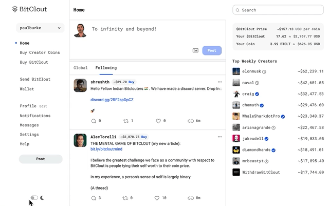

BitClout+ is a Chrome / Brave browser extension that enhances bitclout.com pages

## Features

#### General
- Dark mode (thanks [chapel](https://github.com/chapel/bitclout-darkmode))
- [Omnibox](https://developer.chrome.com/docs/extensions/reference/omnibox/) support: Use keyword "bc" and enter username
- Adds "Edit Profile" button in sidebar
- Adds "Create Post" button in sidebar
- Adds "Your coin" value in sidebar

#### Profile
- Adds follower count and follows you labels
- Shows hodler label
- Shows Founder Reward
- Adds sell button
- Shows coin price in BTCLT
- Shows number of holders
- Shows percentage of coins held for each holder
- Shows positional ranking of coin holders
- Highlights you in coin holder lists
- Adds "Send BitClout" and "Send Message" menu items

#### Buy
- Shows founder fee percentage in buy screen

#### Wallet
- Shows total USD and BitClout value in wallet
- Shows number of coins held
- Shows total BitClout value of coins held

## Installation

Until BitClout+ is available on the Chrome Web Store, you may install manually.

#### Step 1

[Download](https://github.com/iPaulPro/BitCloutPlus/releases/download/v0.3.1/bitcloutplus-0.3.1.zip) the latest release, and unzip.

#### Step 2

Enable [developer mode](https://developer.chrome.com/docs/extensions/mv2/faq/#faq-dev-01) in Chrome or Brave.

#### Step 3

Click "Load unpacked" and select the unzipped project directory.

## Credits

Created by [paulburke](https://bitclout.com/u/paulburke)

Icon by [charliehilton](https://bitclout.com/u/charliehilton)

Dark mode CSS by [chapel](https://bitclout.com/u/lepahc)
