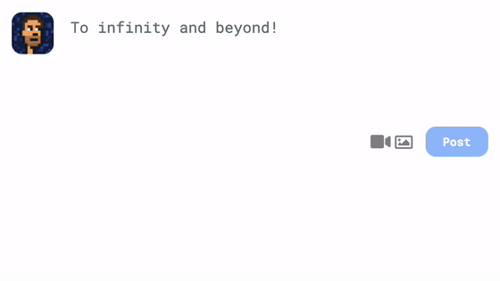

BitClout+ is a free, open source browser extension that enhances BitClout pages

## Installation

## Features

#### General
- [Omnibox](https://developer.chrome.com/docs/extensions/reference/omnibox/) support: Use keyword "bc" and enter username
- Browse as other users (CloutMask)
- Adds "Edit Profile" button in left sidebar
- Adds "Create Post" button in left sidebar
- Adds "Your coin" value in right sidebar

#### Posting
- Changes 560 character limit to 15k on new posts
- Username autocomplete
- Edit posts and comments
- Post extra data support

#### Profile
- Adds _follows you_ labels
- Shows hodler label
- Adds sell button
- Shows coin price in DESO
- Shows number of holders
- Shows percentage of coins held for each holder
- Shows positional ranking of coin holders
- Highlights you in coin holder lists
- Adds "Send DESO" profile menu items
- Recently active indicator
- Jumio verification indicator

#### Wallet
- Shows total USD and BitClout value in wallet

## Credits

Created by [paulburke](https://bitclout.com/u/paulburke)

Icon by [charliehilton](https://bitclout.com/u/charlie)
